# ИДЗ №3 Андрей Гусев БПИ219

# Вариант #2

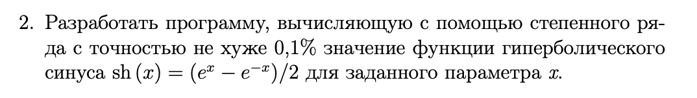

---
**Ограничения ввода:**

1) Водится 1 число типа double.


---
###Критерий №4/10

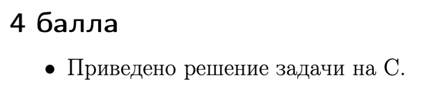

- В проекте это файл `task.c`

---
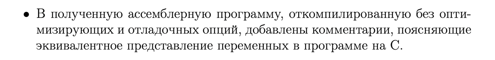

- Компиляция без отладочных опций:

```gcc -O0 -masm=intel task.c -S -o task_1.s```

- После компиляции создался файл `task_1.s`, комментарии написаны в нём

---


- Использованы аргументы командой строки и ручное редактирование, получился файл `task1.s`

```gcc -O0 -Wall -masm=intel -S -fno-asynchronous-unwind-tables -fverbose-asm > -fcf-protection=none task.c```

---
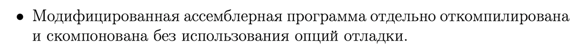

- Программа скомпилирована и скомпонована без опций отладки

```gcc task1.s -o main -lm```

---
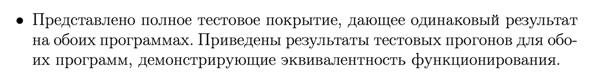

**Тесты**

1) Ввод:

```
1
```

Предполагаемый вывод:

```
1
ExpSin: 1.17520
ExpSin: 1.17500

Difference: 0.99983
```

Вывод программы на C:

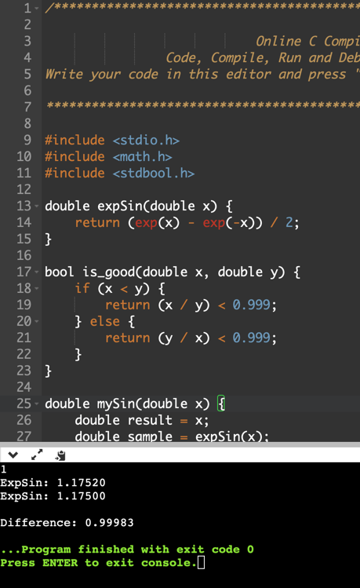

Вывод программы на GAS:

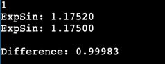
---

2) Ввод:

```
10
```

Предполагаемый вывод:

```
10
ExpSin: 11013.23287
ExpSin: 11008.61552

Difference: 0.99958!
```

Вывод программы на C:

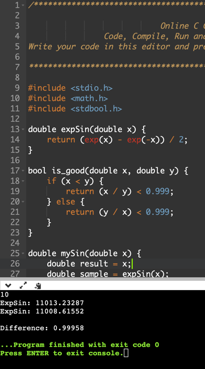

Вывод программы на GAS:

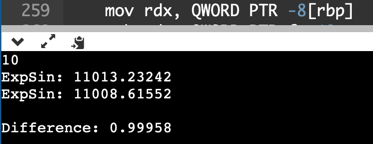
---

3) Ввод:

```
3.14
```

Предполагаемый вывод:

```
3.14
ExpSin: 10.01787
ExpSin: 10.01317

Difference: 0.99953
```

Вывод программы на C:

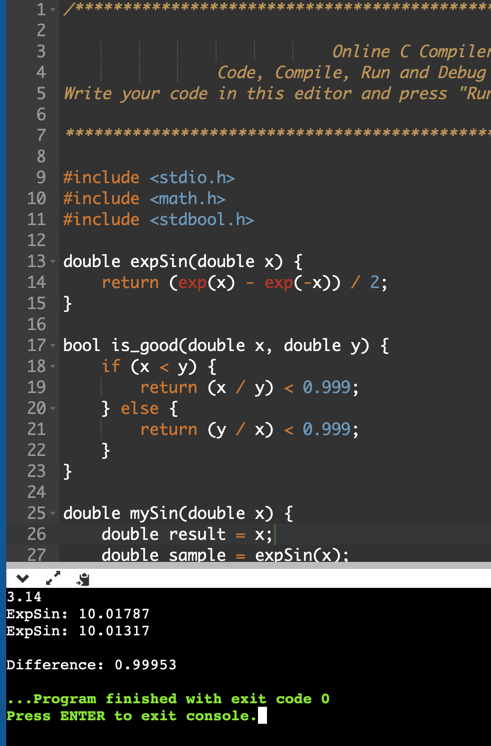

Вывод программы на GAS:

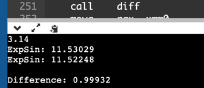-

4) Ввод:

```
0.1234
```

Предполагаемый вывод:

```
0.1234
ExpSin: 0.12371
ExpSin: 0.12371

Difference: 1.00000
```

Вывод программы на C:

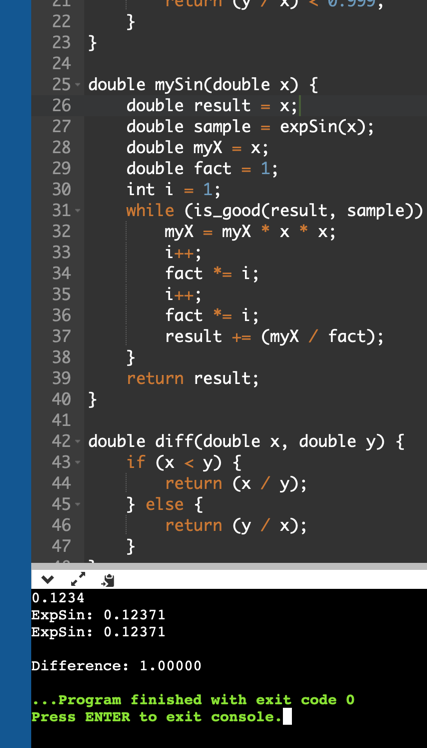

Вывод программы на GAS:

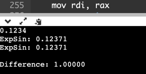
---

5) Ввод:

```
0.75
```

Предполагаемый вывод:

```
0.75
ExpSin: 0.82232
ExpSin: 0.82229

Difference: 0.99997!
```
Вывод программы на C:

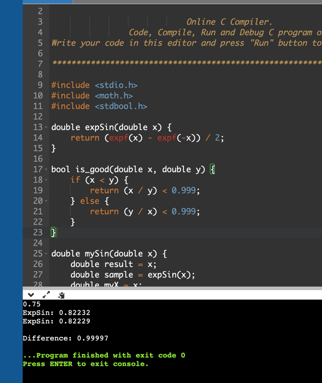

Вывод программы на GAS:

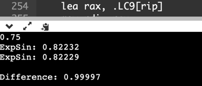
---

6) Ввод:

```
0.47
```

Предполагаемый вывод:

```
0.47
ExpSin: 0.48750
ExpSin: 0.48730

Difference: 0.99961
```

Вывод программы на C:

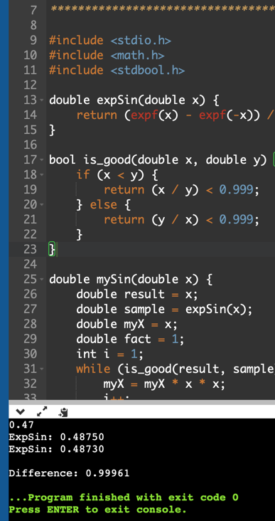

Вывод программы на GAS:

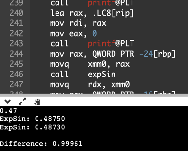
---

---
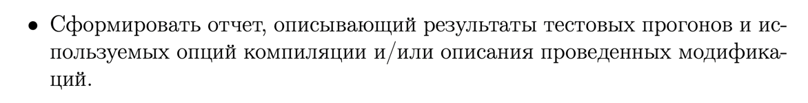

- Сделал.

---

###Критерий №5/10

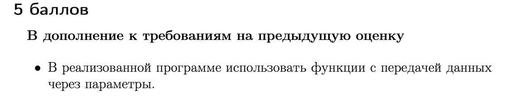

- Функции с передачей данных через параметры использованы (файл `task.c`)

```c
double expSin(double x) {
    return (expf(x) - expf(-x)) / 2;
}

bool is_good(double x, double y) {
    if (x < y) {
        return (x / y) < 0.999;
    } else {
        return (y / x) < 0.999;
    }
}

double mySin(double x) {
    double result = x;
    double sample = expSin(x);
    double myX = x;
    double fact = 1;
    int i = 1;
    while (is_good(result, sample)) {
        myX = myX * x * x;
        i++;
        fact *= i;
        i++;
        fact *= i;
        result += (myX / fact);
    }
    return result;
}

double diff(double x, double y) {
    if (x < y) {
        return (x / y);
    } else {
        return (y / x);
    }
}
```

---


- Локальные переменные использованы

```c
    double x;
    double ans;
```

---
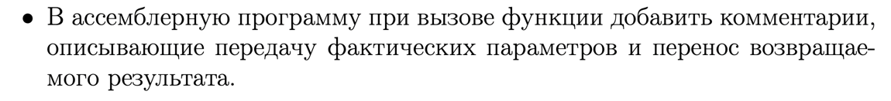

- В ассемблерную программу при вызове функции добавлены комментарии, описывающие передачу фактических параметров и
  перенос возвращаемого результата. Это можно увидеть в файле task1.s

---
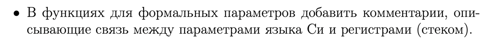

- В функциях для формальных параметров добавлены комментарии, описывающие связь между параметрами языка Си и
  регистрами (стеком). Это можно увидеть в фале task1.s

---
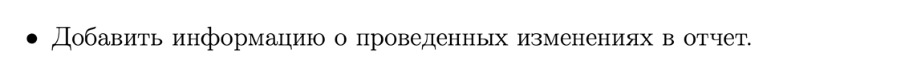

- Информация добавлена в отчёт
